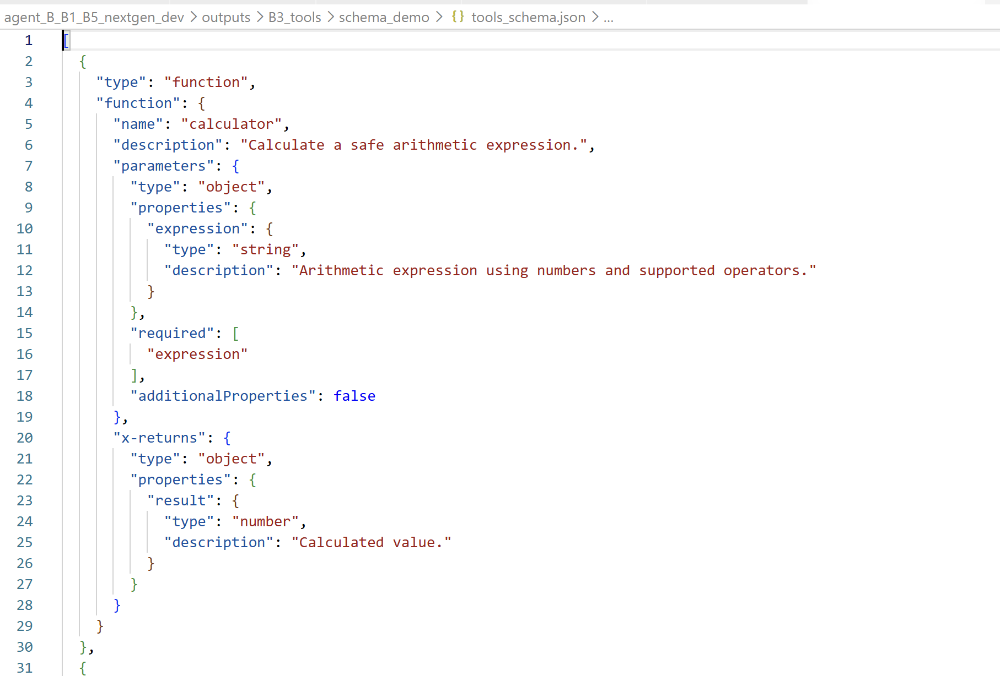
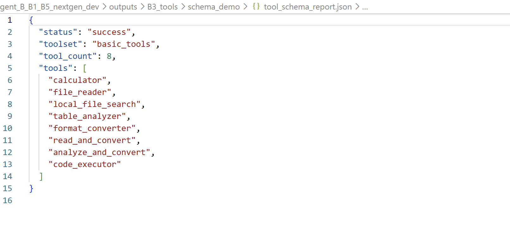
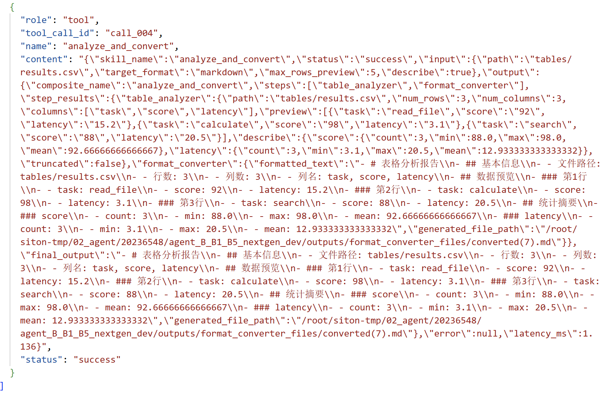
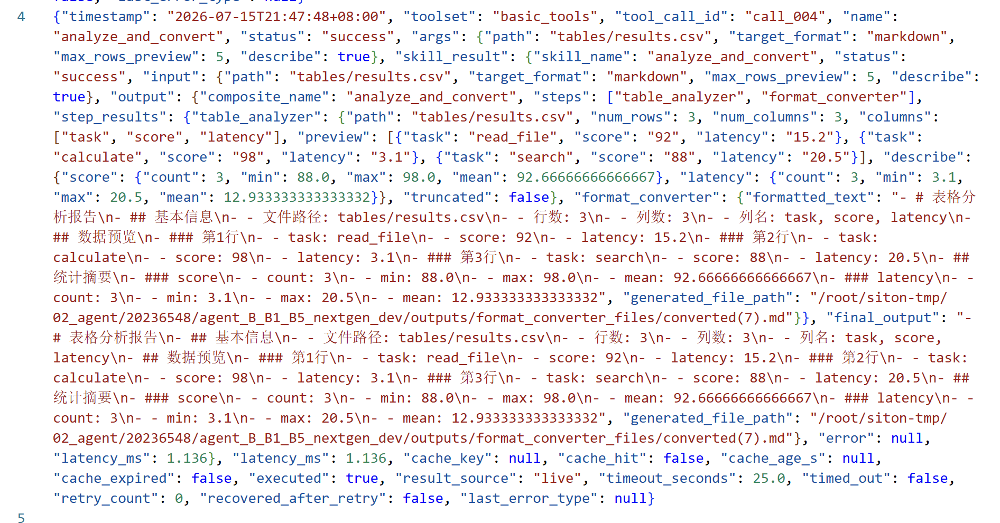
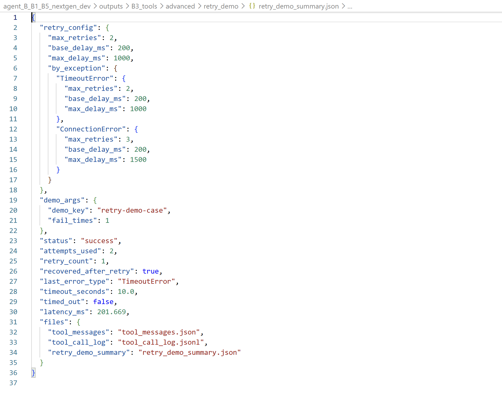
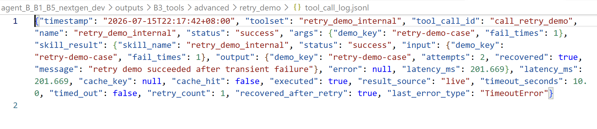
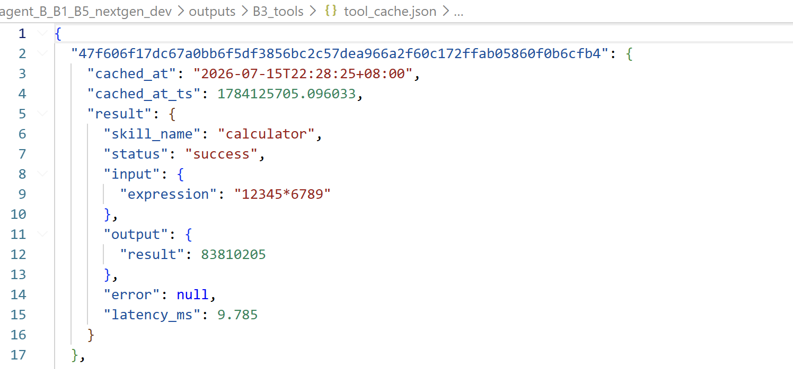
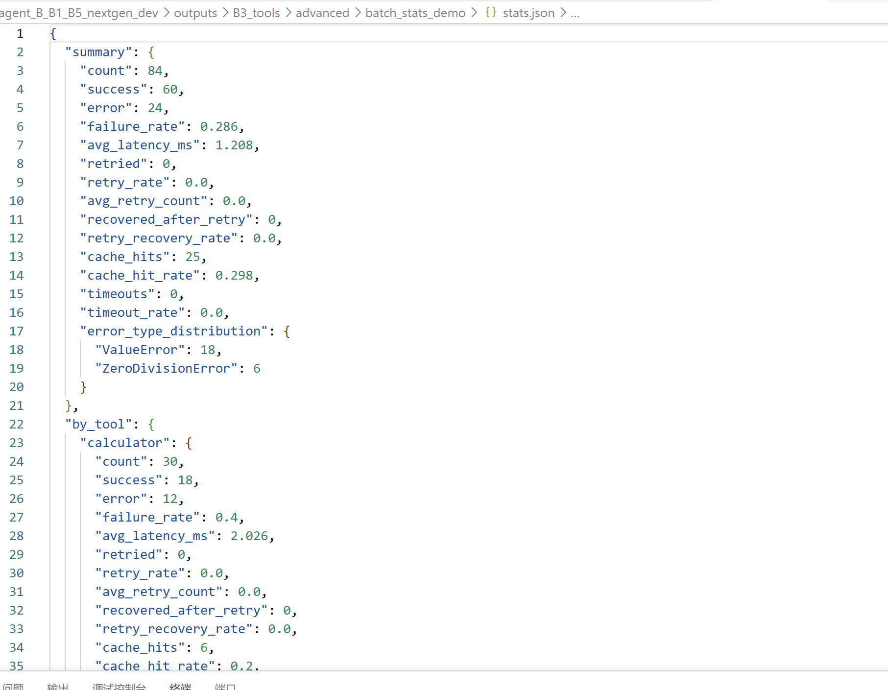
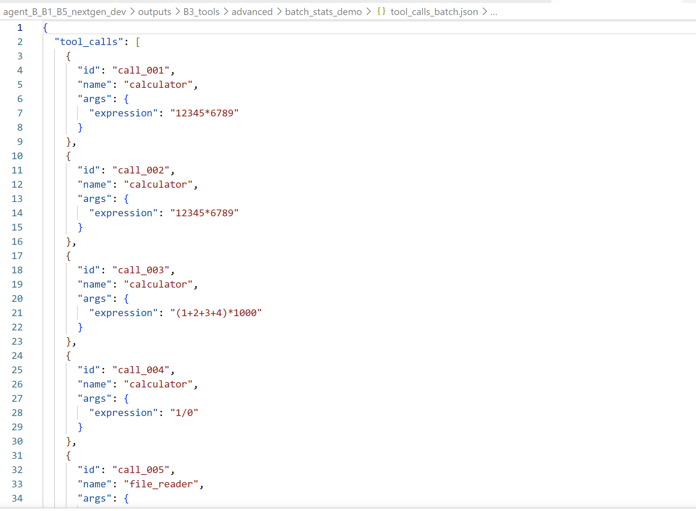
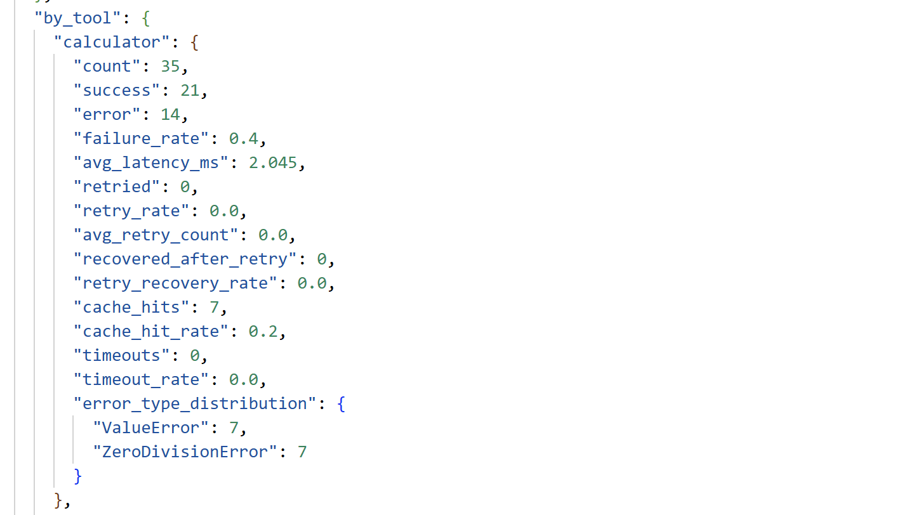

# B3 个人模块 README

> 本文档对应实训 B 方向中的 B3：说明生成与工具调用模块，重点说明基础功能、进阶增强、独立运行方式，以及与团队系统的接口关系。

---

## 1. 模块概述

### 1.1 模块名称

`B3：说明生成与工具调用模块`

### 1.2 模块说明

B3 模块负责在本地 Agent 框架中完成“工具注册、工具说明导出、工具调用执行、标准结果返回、运行日志记录”这一整条链路。

它在系统中的作用可以概括为两部分：

1. 向上为 B4 提供工具说明  
   B3 从 `configs/tools.yaml` 中读取工具配置，按指定 `toolset` 生成标准 `tools_schema.json`，供 B4 作为可调用工具列表使用。

2. 向下执行 B4 生成的 `tool_calls`  
   B3 接收 B4 生成的工具调用请求，校验工具名和参数是否合法，然后调用 B2 中的对应 Skill，最后输出标准 `ToolMessage` 和结构化运行日志。

在此基础上，我进一步实现了以下进阶增强能力：

- 对可恢复错误进行有限重试，提高工具调用稳定性
- 对相同 `name + args` 的工具调用复用历史结果，减少重复执行开销
- 对批量 tool_call 进行统计分析，量化调用次数、失败率、平均耗时等指标
- 增加超时控制、缓存 TTL、按异常类型配置重试策略等工程增强能力

因此，B3 不只是“调用工具”的桥接层，也承担了工具层协议约束、执行控制和可观测性建设的职责。

### 1.3 完成情况概览

| 类型 | 完成情况 |
|---|---|
| 基础要求 | 已完成：支持读取 `tools.yaml`、生成 `tools_schema`、接收并执行 `tool_calls`、输出标准 JSON 文件 |
| 进阶要求 | 已完成：有限重试、结果缓存、批量统计；并扩展实现超时控制、缓存 TTL、更细粒度重试策略 |
| 可独立运行的演示 | 支持 `--export_schema`、`--execute`、`--batch_stats`、`--retry_demo`、`--timeout_demo` |
| 与团队系统集成情况 | 已对接 B1/B4 标准消息流；可作为完整系统中的 B3 工具执行层使用 |

---

## 2. 环境、模型与数据依赖

### 2.1 运行环境

| 项目 | 要求 |
|---|---|
| Python 版本 | Python 3.10 |
| 必要依赖 | `PyYAML`、`requests`，其余依赖见 `requirements.txt` |
| 是否需要模型 | 不需要 |
| 是否需要 GPU | 不需要 |
| 是否需要外部数据集 | 不需要，演示使用项目内样例文件即可 |

### 2.2 模型依赖

本模块本身不依赖大模型，也不直接加载本地模型权重。  
B3 只负责工具说明导出和工具调用执行，因此无需单独准备模型。

### 2.3 数据集或样例数据依赖

| 数据或文件 | 来源 | 项目内相对路径 | 用途 |
|---|---|---|---|
| tool_call 样例消息 | 项目自带 / 自行构造 | `data/messages/ai_message_with_tool_calls.json` | 验证 `--execute` 主链路 |
| 批量统计样例 | 程序自动构造 | 运行时生成 `tool_calls_batch.json` | 验证 `--batch_stats` |
| 表格样例 | 项目自带 | `data/tables/results.csv` | 验证 `table_analyzer` / `analyze_and_convert` |
| 文本样例 | 项目自带 | `data/` 下 txt/md 文件 | 验证 `file_reader` / `read_and_convert` |

### 2.4 安装步骤

```bash
python -m venv .venv
.venv\Scripts\activate
pip install -r requirements.txt
```

如果在 Linux 服务器中，可使用：

```bash
python -m venv .venv
source .venv/bin/activate
pip install -r requirements.txt
```

对于 B3 最小可运行依赖，核心是 `PyYAML` 和 Python 标准库；如果需要联动其他工具，建议直接安装完整 `requirements.txt`。

---

## 3. 文件结构与接口边界

### 3.1 文件结构

```text
personal_b3/
├── code/
│   ├── b3_tool_layer.py              # B3 主执行文件
│   └── common/
│       ├── io_utils.py               # JSON/YAML 读写工具
│       ├── logging_utils.py          # 时间与日志辅助函数
│       ├── path_utils.py             # 路径解析与项目根目录定位
│       └── schemas.py                # ToolMessage / SkillResult 结构工具
├── configs/
│   └── tools.yaml                    # 工具注册、toolset、重试/缓存/超时配置
├── skills/                           # 被 B3 调用的工具实现
├── data/
│   ├── messages/                     # 工具调用输入样例
│   └── tables/                       # 表格分析样例数据
├── outputs/
│   └── B3_tools/                     # B3 标准输出与进阶演示输出
└── README.md                         # 本说明文档
```

### 3.2 接口边界

| 类型 | 来源 / 去向 | 数据格式 | 说明 |
|---|---|---|---|
| 输入 | `tools.yaml` / CLI 参数 | YAML / 命令行参数 | 读取工具配置与运行模式 |
| 输入 | B4 生成的 `tool_calls` | JSON | 由 B4 传入的工具调用请求 |
| 输入 | 本地样例文件 | txt / md / csv / tsv | 提供给工具读取与分析 |
| 输出 | `tools_schema.json` | JSON | 导出的标准工具说明，供 B4 使用 |
| 输出 | `tool_messages.json` | JSON | 工具执行后的标准 ToolMessage 列表 |
| 输出 | `tool_call_log.jsonl` | JSONL | 每次工具调用的详细执行日志 |
| 输出 | `tool_schema_report.json` | JSON | schema 导出摘要 |
| 输出 | `tool_cache.json` | JSON | 缓存内容持久化文件 |
| 输出 | `stats.json` 等 | JSON | 进阶演示中的统计与摘要结果 |

---

## 4. 基础要求实现与演示

### 4.1 基础功能说明

B3 基础部分实现了以下功能：

1. 支持读取 `configs/tools.yaml`
2. 根据 `toolset + tools.yaml` 生成 `tools_schema`
3. `tools_schema` 至少包含工具名称、描述、输入参数、输出结构
4. 支持接收 B4 生成的 `tool_calls`，校验工具名与参数后执行对应 Skill
5. 支持将 schema 与执行结果以 JSON / JSONL 形式落盘保存

### 4.2 基础功能实现路径

| 文件 / 函数 / 脚本 | 作用 |
|---|---|
| `code/b3_tool_layer.py::_load_tools_config` | 读取并校验 `tools.yaml` |
| `code/b3_tool_layer.py::_resolve_toolset` | 根据配置选定工具集合 |
| `code/b3_tool_layer.py::_parameter_schema` | 生成每个工具的参数 schema |
| `code/b3_tool_layer.py::get_tools_schema` | 导出 `tools_schema.json` |
| `code/b3_tool_layer.py::_validate_args` | 校验工具调用参数 |
| `code/b3_tool_layer.py::execute_tool_calls` | 执行 tool_call 主链路 |
| `code/common/schemas.py` | 构造标准 `ToolMessage` / `SkillResult` |

基础流程：

```text
tools.yaml -> 解析配置 -> 选择 toolset -> 导出 tools_schema
B4 tool_calls -> 参数校验 -> 调用对应 Skill -> 生成 ToolMessage -> 写入日志与输出文件
```

关键代码入口示例：

```python
def _load_tools_config(tools_config: str | Path) -> tuple[Path, dict]:
    config_path = Path(tools_config).resolve()
    config = read_yaml(config_path)
    if not isinstance(config, dict):
        raise ValueError("tools.yaml must contain an object")
    if not isinstance(config.get("tools"), dict) or not isinstance(config.get("toolsets"), dict):
        raise ValueError("tools.yaml must define tools and toolsets")
    return config_path, config
```

### 4.3 基础功能输入格式与样例

| 字段 / 输入文件 | 类型 / 格式 | 是否必需 | 说明 |
|---|---|---|---|
| `--tools_config` | 路径 | 是 | 指向 `configs/tools.yaml` |
| `--toolset` | 字符串 | 否 | 指定使用哪个工具集 |
| `--tool_calls` | JSON 文件路径 | `--execute` 时必需 | 指向 tool_call 输入文件 |
| `data/messages/ai_message_with_tool_calls.json` | JSON | 常用样例 | 验证标准执行链路 |

样例输入：

| 样例文件 | 用途 |
|---|---|
| `data/messages/ai_message_with_tool_calls.json` | 验证 B3 接收并执行标准 `tool_calls` |

### 4.4 基础功能演示命令

导出工具说明：

```bash
cd code
python b3_tool_layer.py --tools_config ../configs/tools.yaml --toolset basic_tools --export_schema --outdir ../outputs/B3_tools/schema_demo
```

执行工具调用：

```bash
cd code
python b3_tool_layer.py --tools_config ../configs/tools.yaml --toolset basic_tools --tool_calls ../data/messages/ai_message_with_tool_calls.json --execute --outdir ../outputs/B3_tools/execute_demo
```

运行后重点观察：

- `tools_schema.json` 是否正确导出工具说明
- `tool_messages.json` 是否返回标准 ToolMessage 结构
- `tool_call_log.jsonl` 是否记录每次工具调用的状态与耗时

### 4.5 基础功能输出格式

| 输出文件 / 返回字段 | 格式 | 说明 |
|---|---|---|
| `tools_schema.json` | JSON | 工具说明列表 |
| `tool_schema_report.json` | JSON | schema 摘要报告 |
| `tool_messages.json` | JSON | 工具执行结果消息 |
| `tool_call_log.jsonl` | JSONL | 单次调用日志 |

### 4.6 基础功能结果截图


图 1：`tools_schema.json` 截图，展示 B3 从 `tools.yaml` 成功导出的工具说明结构。



图 2：`tool_schema_report.json` 截图，展示当前导出的 toolset、工具数量和工具列表。



图 3：`tool_messages.json` 截图，展示 B3 执行 `tool_calls` 后返回的标准 ToolMessage 结果。



图 4：`tool_call_log.jsonl` 截图，展示单次工具调用的执行日志、状态和耗时记录。




---

## 5. 进阶要求实现与演示

### 5.1 选择的进阶要求

| 进阶要求 | 是否完成 | 对应文件 / 函数 | 简要说明 |
|---|---|---|---|
| 支持对可恢复错误进行有限重试 | 是 | `b3_tool_layer.py::_load_retry_settings` 等 | 对超时、连接错误等可恢复异常做有限重试 |
| 支持 tool_call 结果缓存 | 是 | `b3_tool_layer.py::_load_cache_settings` 等 | 对相同 `name + args` 的调用复用历史结果 |
| 统计调用次数、失败率、平均耗时 | 是 | `b3_tool_layer.py::_generate_batch_tool_calls` 等 | 自动构造批量样例并输出 `stats.json` |
| 超时控制（扩展实现） | 是 | `b3_tool_layer.py::_call_with_timeout` 等 | 防止单次工具执行长期阻塞 |
| 缓存 TTL（扩展实现） | 是 | `b3_tool_layer.py::_get_tool_cache_ttl_seconds` | 避免长期复用陈旧结果 |

### 5.2 进阶功能 1：支持对可恢复错误进行有限重试

#### 功能说明

基础版本中，工具调用一旦失败会直接返回错误，这在真实场景下会导致稳定性不足。  
因此我实现了有限重试机制：当工具调用出现 `TimeoutError`、`ConnectionError` 或部分可恢复 `OSError` 时，不立即失败，而是在有限次数内再次执行，并采用指数退避降低连续重试压力。

这个功能提升了 B3 工具层在临时故障场景下的恢复能力。

#### 实现路径

| 文件 / 函数 / 脚本 | 作用 |
|---|---|
| `b3_tool_layer.py::_load_retry_settings` | 读取全局重试配置 |
| `b3_tool_layer.py::_get_tool_retry_settings` | 合并工具级重试配置 |
| `b3_tool_layer.py::_is_retriable_exception` | 判断异常是否可恢复 |
| `b3_tool_layer.py::_retry_policy_for_exception` | 按异常类型选择重试策略 |
| `b3_tool_layer.py::_call_with_retry` | 真正执行有限重试与指数退避 |
| `b3_tool_layer.py::run_retry_demo` | 重试功能独立演示入口 |

简要流程：

```text
工具执行失败 -> 判断异常是否可重试 -> 读取对应策略 -> 指数退避等待 -> 再次执行 -> 成功或终止
```

#### 输入格式与样例

| 字段 / 输入文件 / 配置项 | 类型 / 格式 | 是否必需 | 说明 |
|---|---|---|---|
| `settings.retry.max_retries` | 整数 | 是 | 全局最大重试次数 |
| `settings.retry.by_exception` | 对象 | 否 | 按异常类型覆盖策略 |
| `--retry_demo` | CLI 标志 | 演示时必需 | 运行最小可控重试样例 |

#### 演示命令

```bash
cd code
python b3_tool_layer.py --tools_config ../configs/tools.yaml --retry_demo --outdir ../outputs/B3_tools/advanced/retry_demo
```

#### 输出格式

| 输出文件 / 返回字段 | 格式 | 说明 |
|---|---|---|
| `retry_demo_summary.json` | JSON | 重试演示摘要 |
| `tool_call_log.jsonl` | JSONL | 记录 `retry_count`、`recovered_after_retry` 等字段 |
| `tool_messages.json` | JSON | 标准工具结果消息 |

#### 示例图片


图 5：`retry_demo_summary.json` 截图，展示重试演示中的最终状态、重试次数和恢复结果。



图 6：`tool_call_log.jsonl` 中重试相关字段截图，重点展示 `retry_count`、`attempts_used`、`recovered_after_retry` 和 `last_error_type`。




### 5.3 进阶功能 2：支持 tool_call 结果缓存

#### 功能说明

当相同的工具调用被重复执行时，如果每次都重新运行工具，会产生不必要的时间开销。  
因此我实现了结果缓存：对完全相同的 `name + args` 生成唯一缓存键，若缓存命中且未过期，则直接复用历史结果。

此外，我还实现了：

- 工具级缓存开关 `cacheable`
- 错误结果是否缓存 `cache_errors`
- 缓存 TTL 过期控制

#### 实现路径

| 文件 / 函数 / 脚本 | 作用 |
|---|---|
| `b3_tool_layer.py::_load_cache_settings` | 读取全局缓存配置 |
| `b3_tool_layer.py::_is_cacheable_tool` | 判断工具是否允许缓存 |
| `b3_tool_layer.py::_make_cache_key` | 由 `name + args` 生成缓存键 |
| `b3_tool_layer.py::_load_cache` | 读取缓存文件 |
| `b3_tool_layer.py::_get_tool_cache_ttl_seconds` | 获取缓存 TTL |
| `b3_tool_layer.py::_pack_cache_entry` | 写入缓存条目 |
| `b3_tool_layer.py::_unpack_cache_entry` | 解析缓存条目 |
| `b3_tool_layer.py::execute_tool_calls` | 在主链路中接入缓存命中逻辑 |

简要流程：

```text
tool_call -> 生成 cache_key -> 查询缓存 -> 判断 TTL -> 命中则复用 -> 未命中则真实执行并写回缓存
```

#### 输入格式与样例

| 字段 / 输入文件 / 配置项 | 类型 / 格式 | 是否必需 | 说明 |
|---|---|---|---|
| `settings.cache.enabled` | 布尔值 | 是 | 是否开启缓存 |
| `settings.cache.cache_file` | 路径 | 是 | 缓存文件位置 |
| `settings.cache.ttl_seconds` | 数值 | 否 | 全局缓存有效期 |
| 批量样例中的重复调用 | JSON | 是 | 用于验证缓存命中 |

#### 演示命令

建议先清缓存：

```bash
rm -f ../outputs/B3_tools/tool_cache.json
```

再运行：

```bash
cd code
python b3_tool_layer.py --tools_config ../configs/tools.yaml --toolset basic_tools --batch_stats --outdir ../outputs/B3_tools/advanced/batch_stats_demo
```

#### 输出格式

| 输出文件 / 返回字段 | 格式 | 说明 |
|---|---|---|
| `tool_cache.json` | JSON | 持久化缓存内容 |
| `tool_call_log.jsonl` | JSONL | 记录 `cache_hit`、`cache_expired`、`result_source` |
| `stats.json` | JSON | 汇总缓存命中率 |

#### 示例图片


图 7：`tool_call_log.jsonl` 中缓存相关字段截图，重点展示 `cache_hit`、`result_source` 和 `cache_expired`。


图 8：`tool_cache.json` 截图，展示缓存条目已成功落盘保存。



图 9：`stats.json` 中缓存命中率相关字段截图，展示 `cache_hits` 和 `cache_hit_rate`。



### 5.4 进阶功能 3：统计调用次数、失败率、平均耗时

#### 功能说明

为了量化 B3 工具层的性能和稳定性，我实现了批量统计模式。  
该模式会自动构造一批包含成功调用、失败调用、重复调用、参数错误和未知工具的样例，然后真实执行，再基于标准日志聚合得到统计结果。

在课程要求的 `count / failure_rate / avg_latency_ms` 基础上，我还扩展统计了：

- `error_type_distribution`
- `avg_retry_count`
- `retry_recovery_rate`
- `cache_hit_rate`
- `timeout_rate`

#### 实现路径

| 文件 / 函数 / 脚本 | 作用 |
|---|---|
| `b3_tool_layer.py::_generate_batch_tool_calls` | 自动构造批量样例 |
| `b3_tool_layer.py::_summarize_records` | 对执行日志做聚合统计 |
| `b3_tool_layer.py::build_batch_stats` | 运行批量样例并写出 `stats.json` |
| `b3_tool_layer.py::execute_tool_calls` | 提供真实执行记录 |

简要流程：

```text
构造批量样例 -> 执行所有 tool_call -> 读取 tool_call_log.jsonl -> 聚合统计 -> 输出 stats.json
```

#### 输入格式与样例

| 字段 / 输入文件 / 配置项 | 类型 / 格式 | 是否必需 | 说明 |
|---|---|---|---|
| `--batch_stats` | CLI 标志 | 是 | 启用批量统计模式 |
| 自动构造的 `tool_calls_batch.json` | JSON | 运行时生成 | 包含成功/失败/重复/异常样例 |

#### 演示命令

```bash
cd code
python b3_tool_layer.py --tools_config ../configs/tools.yaml --toolset basic_tools --batch_stats --outdir ../outputs/B3_tools/advanced/batch_stats_demo
```

#### 输出格式

| 输出文件 / 返回字段 | 格式 | 说明 |
|---|---|---|
| `tool_calls_batch.json` | JSON | 批量样例输入 |
| `tool_call_log.jsonl` | JSONL | 原始执行日志 |
| `stats.json` | JSON | 聚合统计结果 |

#### 示例图片


图 10：`tool_calls_batch.json` 截图，展示自动构造的批量 tool_call 样例，包括成功、失败、重复和异常调用。



图 11：`stats.json` 的 summary 部分截图，展示 `count`、`failure_rate` 和 `avg_latency_ms` 等核心指标。


图 12：`stats.json` 中 `by_tool` 截图，展示按工具分组的调用统计结果。




---

## 6. 与团队系统的集成说明

B3 在团队系统中的调用关系如下：

1. B4 根据用户输入和 `tools_schema` 生成 `tool_calls`
2. B1 运行时将 `tool_calls` 交给 B3 执行
3. B3 校验并调用对应 Skill
4. B3 返回标准 `ToolMessage`，供 B1/B4 后续整合回复
5. B3 同时写出 `tool_call_log.jsonl` 作为审计与调试依据

在集成过程中，本模块主要关注以下接口边界：

- 输入：`tool_calls` 必须包含 `id / name / args`
- 输出：`tool_messages.json` 中每条消息包含 `role / tool_call_id / name / content / status`
- 配置：依赖 `configs/tools.yaml`
- 工具实现：依赖 `skills/` 目录中对应模块

联调中的重点问题与处理：

- `tools.yaml` 中带逗号的 `description` 需要加引号，避免 YAML 解析错误
- 缓存文件路径与标准输出路径分离，保证团队标准输出不受进阶演示目录影响
- 工具参数中的 `path` 统一使用相对于 `data_root` 的相对路径

---

## 7. 已知问题与后续改进

| 问题 | 当前原因 | 后续改进 |
|---|---|---|
| 默认执行为串行，不是多工具并行调度 | 当前优先保证日志、缓存、输出写入一致性 | 后续可引入独立任务并行调度与并发控制 |
| 缓存命中策略目前仅基于 `name + args` | 未引入更复杂的上下文相关性判断 | 后续可扩展为上下文感知缓存 |
| 统计更偏执行层分析，不直接衡量 B4 的工具选择准确率 | 当前聚焦 B3 工具执行与日志统计 | 后续可联动 B4 设计 schema 描述实验 |
| 部分演示结果依赖手动查看 JSON 文件 | 当前以命令行输出和文件结果为主 | 后续可增加可视化 dashboard 或更友好的报告页 |

---

## 8. 快速运行清单

### 导出 schema

```bash
cd code
python b3_tool_layer.py --tools_config ../configs/tools.yaml --toolset basic_tools --export_schema --outdir ../outputs/B3_tools/schema_demo
```

### 执行标准 tool_calls

```bash
cd code
python b3_tool_layer.py --tools_config ../configs/tools.yaml --toolset basic_tools --tool_calls ../data/messages/ai_message_with_tool_calls.json --execute --outdir ../outputs/B3_tools/execute_demo
```

### 重试演示

```bash
cd code
python b3_tool_layer.py --tools_config ../configs/tools.yaml --retry_demo --outdir ../outputs/B3_tools/advanced/retry_demo
```

### 批量统计演示

```bash
cd code
python b3_tool_layer.py --tools_config ../configs/tools.yaml --toolset basic_tools --batch_stats --outdir ../outputs/B3_tools/advanced/batch_stats_demo
```

### 超时演示

```bash
cd code
python b3_tool_layer.py --tools_config ../configs/tools.yaml --timeout_demo --outdir ../outputs/B3_tools/advanced/timeout_demo
```

---
